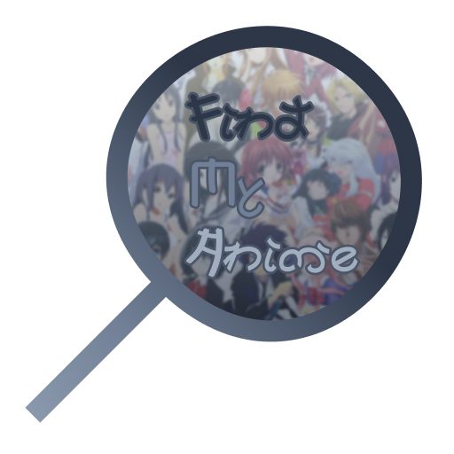

<p align="center">
  
</p>
<h2 style="text-align: center">Find My Anime</h2>
<div style="text-align:center">

[Status](https://status.find-my-anime.dtimur.de) | [API Docs](https://find-my-anime.dtimur.de/api/docs) | [WebApp](https://find-my-anime.dtimur.de)

[](https://codecov.io/gh/proohit/find-my-anime)
[](https://status.find-my-anime.dtimur.de)
[](https://github.com/proohit/find-my-anime/actions/workflows/build.yml)
[](https://sonarcloud.io/summary/new_code?id=proohit_find-my-anime)
[](https://sonarcloud.io/summary/new_code?id=proohit_find-my-anime)
[](https://sonarcloud.io/summary/new_code?id=proohit_find-my-anime)
[](https://sonarcloud.io/summary/new_code?id=proohit_find-my-anime)

</div>

An API first service for searching anime across multiple sites such as Anilist and MyAnimeList. Completely written in Typescript. Provides a backend server in [./server](./server) driven by [anime-offline-database](https://github.com/manami-project/anime-offline-database) and [NestJS](https://nestjs.com/). A proof-of-concept web application is in [./web](./web) and powered by [Vite](https://vitejs.dev/) + [React](https://reactjs.org/) and [Chakra UI](https://chakra-ui.com/).

## Running

You can either run the application via docker or directly from source. See [Configuration](#configuration) for more information.
The easiest way is to use Docker:

```bash
docker run -d -p 3000:3000 proohit/find-my-anime
```

Or to run the whole app without docker in production mode:

```bash
npm install
npm run build
npm start
```

Then you can access the app at http://localhost:3000 or whatever port you configured.

## Developing

Start backend server and frontend in development mode:

```bash
npm run start:dev:server
...
```

And in another terminal:

```bash
npm run start:dev:web
...
```

## Configuration

You can provide a .env or .env.dev (for development) file to configure the backend. Currently supported:

```env
port=YOUR_PORT
MYANIMELIST_API_KEY=YOUR_API_KEY
```

For Docker, you can just pass the environment variables to the container.

```bash
docker run -d -p 3000:3000 -e MYANIMELIST_API_KEY=YOUR_API_KEY proohit/find-my-anime
```

The app uses external services such as Anilist and MyAnimeList to further enrich anime data.

### MyAnimeList

To get a client id, register a new app at https://myanimelist.net/apiconfig. After registering, you will find your client id in the edit page of your registered app. Put that client id into the env file.
